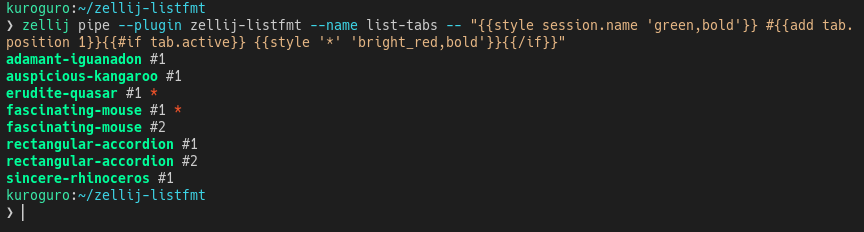

# zellij-listfmt

A Zellij plugin that formats and prints session or tab lists using Handlebars templates.



## Installation

Download the latest `zellij-listfmt.wasm` from [releases](https://github.com/k-kuroguro/zellij-listfmt/releases) and add the following configuration to your Zellij config file:

```kdl
plugins {
   zellij-listfmt location="file:path/to/zellij-listfmt.wasm"
}

load_plugins {
   zellij-listfmt
}
```

## Commands

This plugin lists sessions and tabs through `zellij pipe`, using Handlebars templates for formatting.

```sh
zellij pipe --plugin zellij-listfmt --name <command> [--args <args>] -- <format>
```

- `<command>`: `list-sessions` or `list-tabs`
- `<args>`: Optional argument. Use `current-session` with `list-tabs` to list only tabs in the current session.
- `<format>`: A Handlebars template for formatting the output. \
   - For `list-sessions`: you can access `session` object.
   - For `list-tabs`: you can access both `session` and `tab` objects.
   - Refer to the [Format](#Format) section for available properties of each object.

### Examples

```sh
# List all sessions.
$ zellij pipe --plugin zellij-listfmt --name list-sessions -- "{{session.name}}"
adamant-iguanadon
adventurous-capsicum
auspicious-kangaroo

# List all tabs in all sessions.
$ zellij pipe --plugin zellij-listfmt --name list-tabs -- "{{session.name}} - {{tab.name}}"
adamant-iguanadon - Tab #1
adventurous-capsicum - Tab #1
adventurous-capsicum - Tab #2
auspicious-kangaroo - Tab #1

# List tabs in the current session only.
$ zellij pipe --plugin zellij-listfmt --name list-tabs --args current-session -- "{{session.name}} - {{tab.name}}"
adventurous-capsicum - Tab #1
adventurous-capsicum - Tab #2
```

## Format

You can access the following properties in Handlebars templates:

### Session

```rust
struct Session {
   name: String,
   connected_clients: usize,
   is_current_session: bool,
   web_clients_allowed: bool,
   web_client_count: usize,
   tab_count: usize,
}
```

### Tab

```rust
struct Tab {
   position: usize,
   name: String,
   active: bool,
   is_fullscreen_active: bool,
   is_sync_panes_active: bool,
   are_floating_panes_visible: bool,
   is_swap_layout_dirty: bool,
   viewport_rows: usize,
   viewport_columns: usize,
   display_area_rows: usize,
   display_area_columns: usize,
   selectable_tiled_panes_count: usize,
   selectable_floating_panes_count: usize,
   pane_count: usize,
}
```

### Helpers

In addition to Handlebars' builtin helpers (`if`, `unless`, etc.), the plugin provides:

#### Math helpers

**Helpers**: `{{add a b}}` `{{sub a b}}`, `{{mul a b}}`, `{{div a b}}`, `{{mod a b}}`

Takes two numbers as arguments and returns the result of the operation.

**Example**:
```sh
# List tabs with 1-based index.
$ zellij pipe --plugin zellij-listfmt --name list-tabs --args current-session -- "{{session.name}} - {{add tab.position 1}}"
adventurous-capsicum - 1
adventurous-capsicum - 2
```

#### Style helper

**Helper**: `{{style text attributes}}`

`attributes` is a comma-separated list of style attributes. You can use:
- Styles: `bold`, `underline`, `italic`, `dimmed`, `reversed`, `blink`, `hidden`, `strikethrough`
- Colors: `black`, `red`, `green`, `yellow`, `blue`, `magenta`, `purple`, `cyan`, `white`
- Prefix: `bright_` for bright colors, `on_` for background colors

**Example**:
```sh
# Session name in red and bold, append a white bold asterisk for the current session.
$ zellij pipe --plugin zellij-listfmt --name list-sessions -- "{{style session.name 'red,bold'}}{{#if session.is_current_session}} {{style '*' 'white,bold'}}{{/if}}"
adamant-iguanadon
adventurous-capsicum *
auspicious-kangaroo
```

#### join helper

**Helper**: `{{join arg1 arg2 ... sep=','}}`

Joins multiple arguments with the specified separator.

## Limitation

When multiple clients are connected to the same session, the plugin is loaded multiple times, causing duplicate outputs in the pipe stream.
